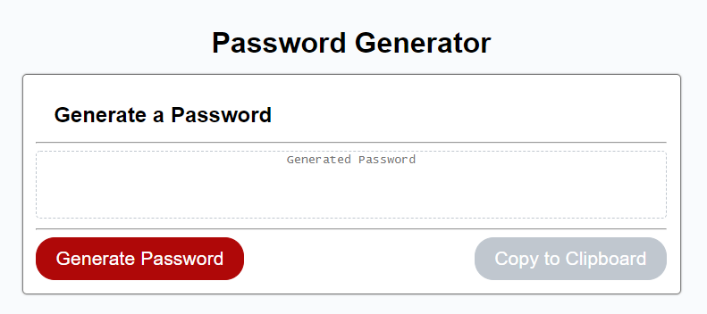
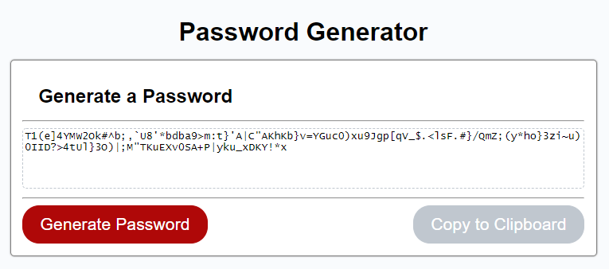
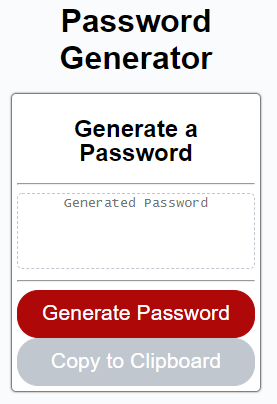
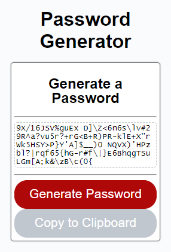

# password-generator

This repository is based on the password generator assignment with the intent of making this implementation
look like the reference image for the project.

## Code responsible for the random number generation:

```javascript
/**
* Swaps two elements of an array
*
* @param {array} array of elements to act on
* @param {number} index of first element for swapping
* @param {number} index of second element for swapping
*/

function swap(array,indexOne,indexTwo) {
    if (
        (indexOne >= 0 && indexOne < array.length) && 
        (indexTwo >= 0 && indexTwo < array.length)
    ) {
        /*  one line solution but looks like it may require more work under the hood
            unless the interpreter is clever
            https://medium.com/better-programming/how-swap-two-values-without-temporary-variables-using-javascript-8bb28f96b5f6
            
            array[indexOne] = [ array[indexTwo], array[indexTwo] = array[indexOne] ][0];
        */
        const temp = array[indexOne];
        array[indexOne] = array[indexTwo];
        array[indexTwo] = temp;
    }
    else {
        throw new Error('Invalid index used in swap()');
    }
}

/**
* Generates a random character from all character classes submitted
*
* @param {string[]} charClasses array of character class strings
* @return {string} random character
*/
function getRandomCharacterFromAllSets(charClasses) {

    /* find number of all characters  */
    let numCharacters = 0;
    for (charClass of charClasses) {
        numCharacters += charClass.length;
    }

    let index = Math.floor(Math.random() * numCharacters);

    for (charClass of charClasses) {                
        if (index >= charClass.length) {
            /* adjust to find the actual index into the charClass */
            index -= charClass.length;
        }
        else {
            return charClass[index];
        }
    }
    return undefined;
}

/**
* Generates a password
*
* Each class will contribute at least one character and all remaining
* characters will be selected randomly from the complete set of all
* character classes.
*
* @param {number} numChars number of characters in the password
* @param {string[]} charClasses array of character class strings
*/
function generatePassword(requiredPasswordLength, charClasses) {
    const password = [];
    
    /* must have enough characters to use at least one of each required character class */
    if (requiredPasswordLength < charClasses.length) {
        throw new Error("Invalid Argument: required password length is too short!"); 
    }

    while(password.length < requiredPasswordLength) {
        if (password.length < charClasses.length) {
            /* 
            * make sure each required character class gets at least a single instance 
            */
            const setIndex = Math.floor(Math.random() * charClasses[password.length].length);
            password.push(charClasses[password.length][setIndex]);
        }
        else {
            /* 
            * Remaining characters should be selected with equal probability from
            * all characters available.
            */
            password.push(getRandomCharacterFromAllSets(charClasses));
        }
    }

    /* randomize array */
    for (let i = 0; i < password.length - 1; ++i) {
        j = Math.floor(Math.random() * (password.length-i)) + i;
        swap(password,i,j);
    }
    
    return password.join("");
}
```

## Image examples of the web page:






## Getting Started

These instructions will get you a copy of the project up and running on your local machine for development and testing purposes. See deployment for notes on how to deploy the project on a live system.

### Prerequisites

Git, SVN, Git Desktop or Microsoft Visual Studio or some disk drive
space to unzip the contents of the repository.

### Installing

1) Visit https://github.com/redmarmaduke/password-generator.
2) Select the Clone or Download button
3) Select the most appropriate format/method for download. 
```
ex. using the command line git tool

git clone https://github.com/redmarmaduke/password-generator-angular.git

```

4) Run `ng serve` for a dev server. Navigate to `http://localhost:4200/`. The application will automatically reload if you change any of the source files.

## Deployment

1) Run `ng build` to build the project. The build artifacts will be stored in the `dist/` directory.

## Built With

* [HTML](https://developer.mozilla.org/en-US/docs/Web/HTML)
* [CSS](https://developer.mozilla.org/en-US/docs/Web/CSS)
* [JS](https://developer.mozilla.org/en-US/docs/Web/JavaScript)
* [Angular](https://angular.io/cli)
* [TypeScript](https://www.typescriptlang.org/)

## Deployed Link

* [See Live Site](https://redmarmaduke.github.io/password-generator-angular/)

## Authors

* **Manuel Nunes** 

- [Link to Github](https://github.com/redmarmaduke/)
- [Link to LinkedIn](https://www.linkedin.com/in/manuel-nunes-272ba31b/)

See also the list of [contributors](./contributors) who participated in this project.

## License

This project is licensed under the MIT License 

## Acknowledgments

* [Copy Clipboard Example](https://www.w3schools.com/howto/howto_js_copy_clipboard.asp)
* [W3Schools.com References](https://www.w3schools.com/)
* [Overflow-Wrap](https://css-tricks.com/almanac/properties/o/overflow-wrap/)


